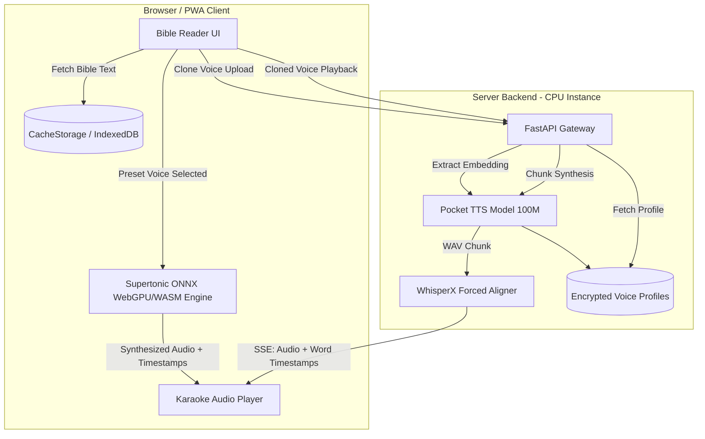

## Summary

A technical implementation plan for a Progressive Web App (PWA) Bible reader offering real-time word-by-word highlighted audio playback. Utilizes a hybrid TTS architecture: preset voices run on-device via Supertonic ONNX (WebGPU/WASM) for zero server compute cost, while custom voice cloning runs on a lightweight CPU server backend via Pocket TTS (Kyutai 100M) and WhisperX alignment.

---

## Problem Frame

Existing Bible listening apps lack personalized voices and low-cost scaling. Server-side GPU speech synthesis for all users is cost-prohibitive. This implementation plan solves both problems by offloading free-tier preset TTS to the user's browser via ONNX WebGPU, reserving CPU server-side inference for paid voice-cloning users.

*(see origin: `docs/brainstorms/2026-08-13-bible-voice-reader-requirements.md`)*

---

## Requirements Traceability

- R1. Bible text navigation (Book, Chapter, Verse) → U1
- R2. Word-by-word synchronized text highlighting → U2, U5
- R3. Play, pause, resume audio controls → U2, U5
- R4. Continuous chapter auto-advance → U5
- R5. On-device preset voices (3+ voices via Supertonic) → U2
- R6. Zero-shot voice cloning from 5–30s audio clip → U4
- R7. Server-side voice profile storage → U4
- R8. Seamless preset vs cloned voice switching → U6
- R9. Voice deletion with immediate revocation and 24h purge → U4
- R10. Launch translations: KJV, WEB, ASV → U1
- R11. Translation switching with position preservation → U1, U5
- R12. Installable PWA (iOS, Android, Desktop) → U6
- R13. WebGPU engine with automatic WASM fallback → U2
- R14. Voice privacy protection & reference audio security → U4
- R15. Transparent data collection & privacy disclosures → U4, U6
- R16. Free-tier access to text and preset voices → U2, U6
- R17. Subscription gate for voice cloning → U4, U6

---

## Key Technical Decisions

**KTD1. Hybrid client/server TTS split.** Preset voices execute entirely in the browser using `@supertone/supertonic-web` via ONNX Runtime Web. Cloned voices execute on a Python/FastAPI server running Pocket TTS (Kyutai 100M) on CPU. *Rationale: Eliminates GPU cloud infrastructure costs for free-tier users ($0 server compute) while keeping paid voice-cloning server costs under $20/mo on standard CPU instances.*

**KTD2. WhisperX forced alignment on CPU.** Pocket TTS generates audio on CPU at ~6x real-time speed. Word-level timestamps for cloned voices are produced using a lightweight WhisperX `int8` forced-alignment pass on sentence chunks. *Rationale: Neither Supertonic nor Pocket TTS emits native word-level JSON timestamps. Forced alignment on known text is fast (<50ms per sentence on CPU) and provides sub-100ms accuracy.*

**KTD3. Sentence-level Server-Sent Events (SSE) streaming.** Cloned TTS audio is requested per chapter and delivered as chunked SSE events containing base64 audio segments and JSON word-timestamp arrays. *Rationale: Enables sub-2 second Time-To-First-Audio (TTFA) without waiting for an entire chapter to synthesize.*

**KTD4. IndexedDB model & text caching.** Supertonic ONNX model files (~100-200MB) and public domain Bible text JSONs are cached in IndexedDB / CacheStorage via Service Worker. *Rationale: Ensures instant startup on subsequent visits and offline text reading capability.*

---

## High-Level Architecture Design

---

## Implementation Units

### U1. Bible Text Engine & Translation Switcher

- **Goal:** Build the Bible navigation data layer supporting KJV, WEB, and ASV with position preservation.
- **Files to create/modify:**
  - `src/services/bible/types.ts`
  - `src/services/bible/bibleService.ts`
  - `src/data/translations/kjv.json`
  - `src/data/translations/web.json`
  - `src/data/translations/asv.json`
  - `src/components/BibleView.tsx`
  - `src/components/TranslationSelector.tsx`
- **Approach:** Structure Bible text as indexed JSON documents (`book`, `chapter`, `verse`, `words[]`). Provide `getPassage(translation, book, chapter)` API that maintains reading position (verse offset) when `translation` changes.
- **Test Scenarios:**
  - `tests/unit/bibleService.test.ts`: Verify KJV, WEB, and ASV text lookup by book/chapter/verse.
  - `tests/unit/translationSwitch.test.ts`: Verify switching translation from KJV to WEB on John 3:16 retains verse index 16.
- **Verification:** Run `npm test tests/unit/bibleService.test.ts`.

### U2. On-Device Supertonic Preset TTS Engine

- **Goal:** Integrate `@supertone/supertonic-web` for in-browser preset voice synthesis with WebGPU and WASM fallback.
- **Files to create/modify:**
  - `src/services/tts/supertonicEngine.ts`
  - `src/services/tts/types.ts`
  - `src/services/tts/durationAligner.ts`
  - `src/components/PresetVoiceSelector.tsx`
- **Approach:** Load Supertonic ONNX models via `onnxruntime-web`. Check WebGPU availability; fall back to WebAssembly (WASM) multi-threading if unsupported. Map phoneme duration predictor output to text word timestamps for highlighting.
- **Test Scenarios:**
  - `tests/unit/supertonicEngine.test.ts`: Test WebGPU initialization and WASM fallback trigger on unsupported browser mocks.
  - `tests/unit/durationAligner.test.ts`: Test mapping phoneme duration arrays to word-level start/end timestamps.
- **Verification:** Run `npm test tests/unit/supertonicEngine.test.ts`.

### U3. Server-Side Pocket TTS & WhisperX Alignment Pipeline

- **Goal:** Build the Python FastAPI backend service running Pocket TTS synthesis and WhisperX forced alignment on CPU.
- **Files to create/modify:**
  - `server/main.py`
  - `server/services/tts_service.py`
  - `server/services/aligner_service.py`
  - `server/requirements.txt`
  - `server/Dockerfile`
- **Approach:** Set up FastAPI server. Implement `TTSService` using `kyutai-pocket-tts` (100M model) on CPU. Implement `AlignerService` using `whisperx` on CPU with `int8` quantization. Expose `/api/v1/tts/stream` endpoint returning Server-Sent Events (SSE) with audio chunks + word timestamp metadata.
- **Test Scenarios:**
  - `server/tests/test_tts_service.py`: Verify Pocket TTS generates valid 24kHz audio buffer from input text on CPU.
  - `server/tests/test_aligner_service.py`: Verify WhisperX returns valid word-level `start` and `end` timestamps for audio buffer and transcript.
  - `server/tests/test_stream_endpoint.py`: Test SSE endpoint returns chunked payloads with <2s latency.
- **Verification:** Run `pytest server/tests/`.

### U4. Voice Cloning Enrollment & Privacy Storage Service

- **Goal:** Implement reference audio upload, speaker embedding extraction, user profile storage, and 24h deletion purge.
- **Files to create/modify:**
  - `server/routers/voice_cloning.py`
  - `server/services/voice_profile_service.py`
  - `server/models/voice_profile.py`
  - `src/services/api/voiceCloningApi.ts`
  - `src/components/VoiceCloningModal.tsx`
- **Approach:** Accept 5–30s audio recording via `/api/v1/voices/clone`. Validate audio duration and format. Extract speaker embedding using Pocket TTS encoder. Store encrypted embedding linked to `user_id`. Implement DELETE endpoint `/api/v1/voices/{voice_id}` that revokes access immediately and queues background file deletion.
- **Test Scenarios:**
  - `server/tests/test_voice_cloning.py`: Verify 400 error for audio <5s or >30s. Verify 200 OK for valid clip and embedding creation.
  - `server/tests/test_voice_deletion.py`: Verify voice deletion revokes API access immediately and marks profile for purge.
- **Verification:** Run `pytest server/tests/test_voice_cloning.py`.

### U5. Audio Player & Karaoke Word-Sync Engine

- **Goal:** Build the frontend audio playback controller with SSE streaming reader, Web Audio API output, and real-time word highlighting.
- **Files to create/modify:**
  - `src/services/audio/karaokePlayer.ts`
  - `src/components/AudioControls.tsx`
  - `src/components/HighlightedVerse.tsx`
- **Approach:** Maintain playback timeline linked to `requestAnimationFrame`. As audio plays, match current playback time against word `start`/`end` timestamp arrays. Highlight active word in DOM with smooth CSS transitions. Auto-advance to next chapter on playback end.
- **Test Scenarios:**
  - `tests/unit/karaokePlayer.test.ts`: Verify word highlight index updates correctly at timestamp boundaries (±50ms tolerance).
  - `tests/unit/autoAdvance.test.ts`: Verify chapter auto-advance triggers when last verse finishes playing.
- **Verification:** Run `npm test tests/unit/karaokePlayer.test.ts`.

### U6. Freemium UI, Onboarding & PWA Offline Shell

- **Goal:** Wrap app as an installable PWA with Service Worker offline caching, voice selection tiering, and privacy notices.
- **Files to create/modify:**
  - `public/manifest.json`
  - `src/sw.ts`
  - `src/components/Header.tsx`
  - `src/components/OnboardingModal.tsx`
  - `src/components/VoiceSelector.tsx`
  - `src/components/SubscriptionGate.tsx`
- **Approach:** Configure Vite PWA plugin. Register Service Worker caching Bible JSONs and static assets. Build unified voice selector showing free preset voices vs locked cloned voice creation (gated by subscription status). Display clear privacy disclosure on voice upload modal.
- **Test Scenarios:**
  - `tests/e2e/pwaInstallation.test.ts`: Test manifest properties and Service Worker registration.
  - `tests/unit/subscriptionGate.test.ts`: Test cloning UI is gated for free users and unlocked for subscribers.
- **Verification:** Run `npm run test:e2e` and audit Lighthouse score (target: >90 PWA score).

---

## Risks & Dependencies

- **Risk 1: Firefox WebGPU Support.** WebGPU support in Firefox remains behind a flag on some platforms. *Mitigation: U2 implements explicit WebAssembly (WASM) fallback so Firefox users retain full preset TTS functionality.*
- **Risk 2: CPU Server Memory under Load.** Concurrent Pocket TTS + WhisperX requests could spike CPU/RAM usage. *Mitigation: Server queue limits active concurrent synthesis requests to match available vCPU cores.*

---

## Sources & Research

- Upstream Requirements: `docs/brainstorms/2026-08-13-bible-voice-reader-requirements.md`
- TTS Analysis: `tts_engine_analysis.md`
- Kyutai Pocket TTS: 100M parameter model optimized for CPU inference (6x real-time speed, ~200ms TTFA).
- Supertonic Web: `@supertone/supertonic-web` ONNX Runtime Web package.
