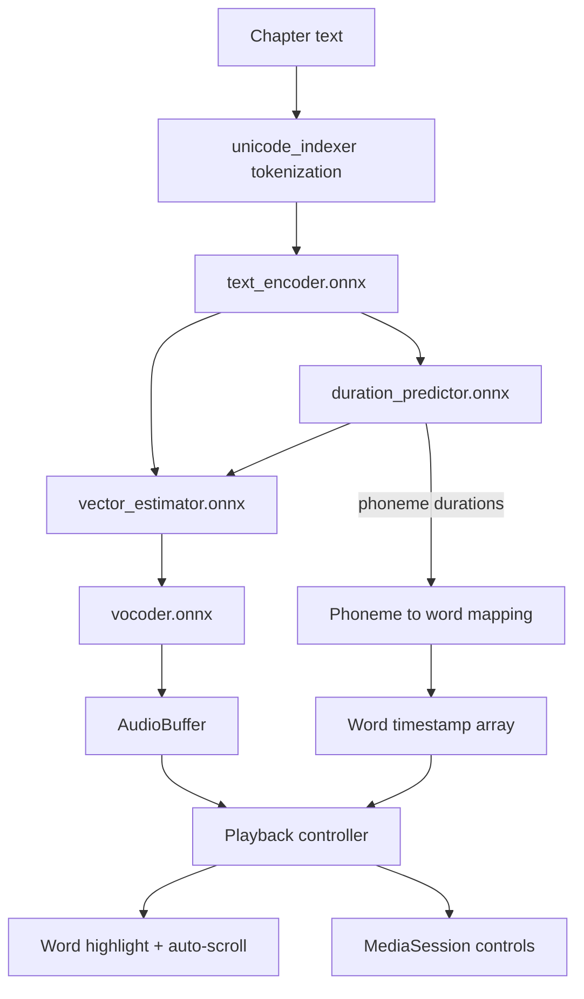
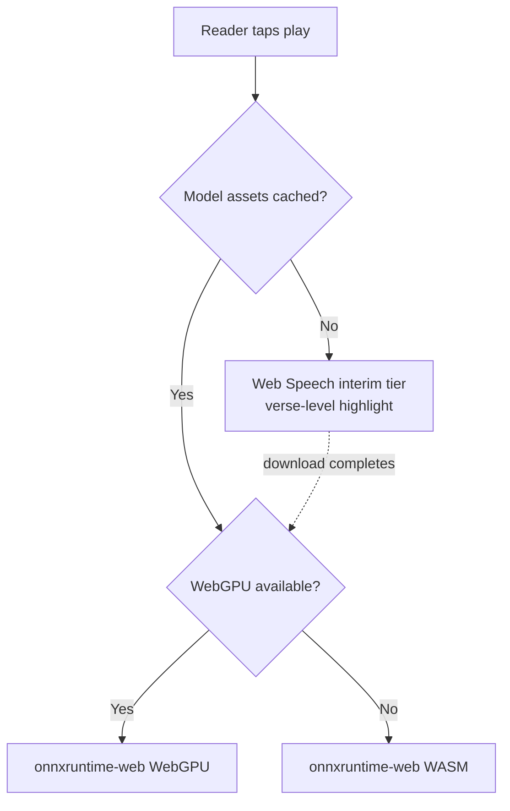

## Summary

Rebuild Scripture Voice as a self-contained offline Bible reader with genuine on-device speech. All 66 books of KJV, WEB, and ASV ship as bundled per-book JSON, removing the live-API dependency. Preset voices move from `speechSynthesis` impersonation to real Supertonic ONNX inference driven directly through `onnxruntime-web`, which makes word-level highlighting accurate for the first time. Voice cloning, the Python backend, and the subscription gate are removed.

---

## Problem Frame

The current build compiles cleanly and does almost nothing it claims. `SupertonicEngine` is `window.speechSynthesis` with pitch offsets; `onnxruntime-web` is a dependency with no imports. Voice cloning generates a UUID and stores a dict — no audio is processed, and cloned voices fall through to the default system voice. The documented IndexedDB cache, offline support, and text-download script do not exist. Chapter text comes from a live call to a volunteer-run API whose only fallback parses a response shape that source never returns.

On top of that, the playback loop is broken in ways no test would have caught: auto-advance re-reads the previous chapter forever through a stale closure, pause is a disguised stop, and the play path awaits a network fetch before speaking, which severs the iOS user-gesture chain. The app targets mobile, and word highlighting — the only remaining differentiator — depends on `onboundary` events that Chrome Android and iOS Safari do not reliably fire.

V1 trades the origin document's core value proposition for one that actually ships. Cloning a loved one's voice is deferred, not cancelled (see origin: `docs/brainstorms/2026-08-13-bible-voice-reader-requirements.md`).

---

## Requirements

Origin R-IDs are preserved where the requirement survives into V1. R18 and above are new to this plan.

**Core reading experience**

- R1. The app displays Bible text by book, chapter, and verse, with navigation to any passage.
- R2. Audio playback highlights each word as it is spoken, synchronized to word-level timestamps derived from the synthesis pipeline.
- R3. The user can play, pause, and resume audio at any point within a chapter, and resuming continues from the paused position.
- R4. Playback auto-advances across chapters and across book boundaries without replaying or skipping content.
- R18. The app restores the reader's last position — translation, book, chapter — on launch.
- R19. The active word scrolls into view during playback without the reader chasing it.

**Bible content**

- R10. The app includes KJV, WEB, and ASV at launch.
- R11. The user can switch translation without losing reading position.
- R20. Chapter text loads from bundled local assets with no network request on the critical path.
- R21. Failure to load a passage produces a visible, actionable error state rather than a blank screen.

**Voice**

- R5. The app ships at least three preset voices, synthesized on-device.
- R8. The user can switch between preset voices at any time during a reading session.
- R13. Synthesis uses WebGPU where available and falls back to WebAssembly automatically.
- R22. Until model assets finish downloading, playback remains available through a clearly-labelled interim engine.

**Platform**

- R12. The app is an installable PWA on mobile and desktop, passing the browser install gate.
- R23. Bundled translations and downloaded model assets remain available offline after first load.
- R24. Playback exposes lock-screen and hardware media controls where the platform supports them.

**Licensing and disclosure**

- R25. Distributed model weights carry the BigScience Open RAIL-M license text, attribution notices, and a change notice covering quantization.
- R26. The app's terms bind end users to the Attachment A use restrictions, and the UI discloses that narration audio is machine-generated.

**Removed from scope**

- R6, R7, R9, R14, R15, R17 — voice cloning, server-side voice profiles, deletion and purge, voice-audio privacy handling, pre-upload disclosure, and the subscription gate. All are deferred with the cloning feature.
- R16 survives trivially: with no paid tier, all functionality is free.

---

## Key Technical Decisions

KTD1. **Single ingest source: `wldeh/bible-api` via jsDelivr.** All three translations return HTTP 200 with a uniform `{"data":[{book,chapter,verse,text}]}` shape. The alternative, `scrollmapper/bible_databases`, offers single-file downloads for KJV and ASV but has no WEB translation, which would force two parsers against two sources. *One source, one parser, verified coverage.*

KTD2. **Text ships as static per-book JSON under `public/bibles/`, committed to the repo.** Roughly 16 MB across 198 files. Committing the generated output keeps builds reproducible and removes a CDN dependency from CI. Vite dynamic imports were rejected — 198 code-split chunks bloat the build graph for data that is not code.

KTD3. **Drive the four ONNX graphs directly with `onnxruntime-web`.** `@supertone/supertonic-web`, named in the origin document and the prior plan, does not exist on npm. No browser-ready wrapper exists: `supertonic` v0.0.1 is Node-shaped with no browser field, and `easy-supertonic-tts` depends on `onnxruntime-node`. *`onnxruntime-web` is already a dependency; the wrapper was always going to be ours to write.*

KTD4. **Ship fp32 weights, not int8. Reversed after measurement.** Quantizing worked as a download saving — 380 MB down to 102.7 MB, with audio quality unaffected (rms 0.0760 against fp32's 0.0765). It failed as engineering. Dynamic int8 has no optimized WASM kernels, so it dequantizes per operation and runs roughly seven times slower:

| flow steps | fp32 | int8 |
| --- | --- | --- |
| 2 | 1.79x realtime | 0.24x |
| 4 | 1.11x realtime | 0.14x |
| 8 | 0.62x | 0.08x |

fp32 clears realtime at four steps on one WASM thread with no GPU; int8 never clears it at any step count. Synthesis slower than playback means an unbounded wait before first audio and a stall before every subsequent sentence — which is exactly how the int8 build behaved in manual testing. *Download size is a one-time cost that caching amortizes; throughput is paid on every sentence forever.*

The build script still quantizes on request, and fp16 (~190 MB) remains worth measuring as a middle option. Model sourcing is unchanged: build from the official `Supertone/supertonic-3` release rather than third-party packs, since `csukuangfj2/sherpa-onnx-supertonic-3-tts-int8-2026-05-11` carries no license tag and `onnx-community/Supertonic-TTS-ONNX` ships no LICENSE file at all.

KTD5. **Word timing is interpolated within model-anchored sentence boundaries.** The U11 spike measured the real signature: `duration_predictor.onnx` takes `text_ids`, `style_dp`, and a rank-3 `text_mask`, and returns `duration` as a **single scalar** — total utterance seconds, not per-token durations. Verified to scale monotonically with text length at 88–145 wpm across two voice styles. Per-word timing is therefore not readable from the graph.

Because U6 synthesizes per sentence anyway for time-to-first-audio, each sentence gets its own model-predicted duration. Word positions are interpolated by character weight *within* that sentence, and every sentence re-anchors the clock. *Error stays bounded inside one sentence and never accumulates, so a chapter cannot drift even though individual word positions are approximate.* Tokenization is character-level via a 65,536-entry codepoint table, so character weighting matches what the model actually consumed.

KTD6. **Web Speech remains as a labelled interim engine during model download.** A 138 MB wall before any audio plays is an unacceptable first run. The existing `speechSynthesis` path already works on desktop and costs nothing to keep as a fallback tier. Highlighting degrades to verse-level while interim, and the UI says so. *Reversible: if first-run telemetry shows the interim tier confuses more than it helps, gate playback instead.*

KTD7. **Offline text uses read-through caching plus an opt-in full download per translation.** Precaching 16 MB of text on install is hostile on mobile data. Chapters cache as they are read; a per-translation "make available offline" action warms the rest deliberately.

---

## High-Level Technical Design

Synthesis pipeline and its two timing consumers:



Engine tier selection at play time:



Signatures confirmed by the U11 spike, loaded through `onnxruntime-web`:

| Graph | Inputs | Output |
| --- | --- | --- |
| `duration_predictor` | `text_ids` int64 [1,N], `style_dp` float32 [1,8,16], `text_mask` float32 [1,1,N] | `duration` float32 **[1]** |
| `text_encoder` | `text_ids`, `style_ttl`, `text_mask` | `text_emb` |
| `vocoder` | `latent` | `wav_tts` |

`duration` is a scalar, so the phoneme-level branch of the diagram does not exist — see KTD5. Audio output at 44.1 kHz is not yet proven end to end; `vector_estimator` still needs wiring in U6.

---

## Output Structure

```text
scripts/
  build-bible-data.mjs        # ingest + normalize + validate
  build-model-assets.mjs      # download, quantize, license, manifest
public/
  bibles/{kjv,web,asv}/{book-slug}.json
  models/supertonic-3-int8/   # graphs, voice styles, LICENSE, NOTICE, manifest
  icons/                      # pwa-192, pwa-512, apple-touch, favicon
src/services/tts/
  supertonicEngine.ts         # ONNX session + graph chain
  wordTiming.ts               # duration predictor to word timestamps
  webSpeechFallback.ts        # interim tier
```

---

## Implementation Units

### Phase A — Foundation

### U1. Project foundation and documentation correction

- Goal: Establish version control, a test runner, and accurate documentation before any behavior changes.
- Requirements: prerequisite for all units.
- Dependencies: none.
- Files: `.gitignore`, `vitest.config.ts`, `playwright.config.ts`, `package.json`, `README.md`, `walkthrough.md`, `tests/setup.ts`
- Approach: `git init` with `node_modules/` and `dist/` ignored — `dist/` is currently committed and should not be. Add two test tiers, because one will not cover this plan: Vitest with jsdom for pure logic, and Playwright for anything touching real audio, WebGPU, service workers, or install criteria. `onnxruntime-web` does not run meaningfully under jsdom, so U6, U7, and U10 verify in a real browser. Rewrite `walkthrough.md` to describe what exists; every verification claim in it is currently false, and its `scripts/download-bibles.js` reference points at a file that was never written.
- Test scenarios: `Test expectation: none -- tooling and documentation only. Both harnesses are exercised by U2 onward.`
- Verification: both runners execute against an empty suite without error; `walkthrough.md` contains no claim contradicted by the source tree.

### U2. Bible text ingest pipeline

- Goal: Produce all 198 per-book translation files from a single verified source.
- Requirements: R10, R20.
- Dependencies: U1.
- Files: `scripts/build-bible-data.mjs`, `public/bibles/**`, `tests/scripts/buildBibleData.test.ts`
- Approach: Fetch each book's chapters from `wldeh/bible-api` via jsDelivr with bounded concurrency and retry. Normalize the source `{"data":[...]}` envelope into per-book `{book, chapters: {"1": [{verse, text}]}}`. Validate chapter counts against the existing `BIBLE_BOOKS` catalog and fail the build on any mismatch or empty chapter — a silently short book is worse than a failed build.
- Patterns to follow: the book catalog and chapter bounds already in `src/services/bible/bibleService.ts` are correct and should be the validation oracle.
- Test scenarios:
  - Normalizer converts a `{"data":[...]}` chapter payload into the per-book shape with verse numbers as integers and whitespace collapsed.
  - Validation fails when a book's produced chapter count differs from the catalog count.
  - Validation fails when any chapter contains zero verses.
  - Retry logic surfaces a terminal error after exhausting attempts rather than writing a partial file.
  - Single-chapter books (Obadiah, Philemon, Jude, 2 John, 3 John) produce a chapter map with exactly one key.
- Verification: script produces 66 files per translation; total verse count per translation is within expected bounds for that text.

### U3. Local-first Bible service with offline cache

- Goal: Serve chapters from bundled assets with persistent caching and real error states.
- Requirements: R1, R11, R20, R21, R23.
- Dependencies: U2.
- Files: `src/services/bible/bibleService.ts`, `src/services/bible/bibleCache.ts`, `src/components/BibleView.tsx`, `tests/services/bibleService.test.ts`
- Approach: Replace `fetchChapterVersesAsync`'s two network paths with a fetch against `public/bibles/`. Both current paths go: `bible-api.com` is a rate-limited volunteer service on the critical path, and the CDN fallback parses `data.verses` against a source that returns `data` — it has never once succeeded. Add IndexedDB persistence behind the existing in-memory map, and surface load failure as a rendered error state; `BibleView` currently maps an empty array into a blank screen.
- Test scenarios:
  - A chapter request returns all verses in order with correct verse numbers.
  - Requesting the same chapter twice issues one fetch and serves the second from cache.
  - Switching translation on a fixed book and chapter returns that same reference in the new translation.
  - A rejected fetch produces an error result, not an empty verse array.
  - Cached chapters survive a simulated reload via the IndexedDB layer.
  - An out-of-range chapter for a book returns a not-found result rather than an empty success.
- Verification: the app loads Genesis 1, Psalm 119, and Revelation 22 across all three translations with the network disabled after first load.

### U4. Remove voice cloning, backend, and subscription gate

- Goal: Delete the cloning feature surface and its dead dependencies.
- Requirements: retires R6, R7, R9, R14, R15, R17.
- Dependencies: U1.
- Files: delete `server/`, `src/services/api/voiceCloningApi.ts`, `src/components/VoiceCloningModal.tsx`, `src/data/translations/`; modify `src/App.tsx`, `src/components/Header.tsx`, `src/components/VoiceSelector.tsx`, `package.json`
- Approach: Remove the `isSubscribed` state and the subscription props threaded through `Header` — `onToggleSubscription` is passed but never used, and the gate never gated anything. Delete the bundled `src/data/translations/*.json` files, which no module imports. The Python backend goes entirely; `server/services/aligner_service.py` annotates a parameter as `string`, which is a `NameError` on any Python below 3.14 and proves the module was never executed.
- Test scenarios:
  - The voice selector renders preset voices with no cloning entry point and no locked or gated state.
  - The app builds with no unresolved imports after deletion.
  - No remaining source file references `localhost:8000` or the cloning API surface.
- Verification: `npm run build` succeeds; a repository-wide search for cloning, subscription, and backend identifiers returns nothing.

### Phase B — On-device voice

### U11. Graph execution spike

- Goal: Prove the ONNX chain runs in a browser and yields usable word timing, before committing to the asset pipeline.
- Requirements: gates R2, R5, R13.
- Dependencies: U1.
- Files: `spikes/supertonic-chain/` (throwaway; not shipped)
- Approach: Load the four fp32 graphs directly from Hugging Face in a scratch page and confirm three things in order: the input and output tensor signatures of each graph; that the chain produces audible audio through `onnxruntime-web`; and that the duration predictor's output maps onto word boundaries. Use fp32 here — quantization is a separate variable and U5 owns it.
- Execution note: this is a throwaway spike. Findings update KTD5 and the U6/U7 approaches; the code is discarded.
- Test scenarios: `Test expectation: none -- exploratory spike. Its output is a go/no-go decision and confirmed tensor signatures, recorded in this plan before U5 begins.`
- Verification: a short passage synthesizes audibly in a browser, and phoneme durations are shown to map onto word boundaries — or the fallback position below is triggered.

**Go/no-go.** If the chain runs but timing does not map to words, proceed with U7's sentence-bounded fallback and record the reduced R2 accuracy. If the chain cannot be driven from `onnxruntime-web` at all, stop Phase B: V1 ships on the Web Speech tier with verse-level highlighting, Phase C proceeds unchanged, and the engine decision returns to the user. Discovering this in a one-file spike costs a day; discovering it after U5 costs the asset pipeline too.

### U5. Model asset pipeline and Open RAIL-M compliance

- Goal: Produce a licensed, versioned, browser-sized model bundle and the disclosure surface it obligates.
- Requirements: R25, R26.
- Dependencies: U1, U11.
- Files: `scripts/build-model-assets.mjs`, `public/models/supertonic-3-int8/**`, `src/components/AudioDisclosure.tsx`, `docs/TERMS.md`, `tests/scripts/buildModelAssets.test.ts`
- Approach: Download the four graphs, `unicode_indexer.json`, `tts.json`, and the ten voice styles from `Supertone/supertonic-3`. Quantize to int8, targeting the 138 MB envelope. Carry the upstream LICENSE verbatim and emit a NOTICE recording that the weights were quantized, satisfying the change-notice condition. Emit a version manifest so the client can detect upstream model updates rather than caching 138 MB indefinitely. Add a persistent UI disclosure that narration is machine-generated, and reproduce the Attachment A use restrictions in `docs/TERMS.md` as terms binding on end users.
- Test scenarios:
  - The built bundle contains LICENSE and NOTICE files alongside the weights.
  - The manifest records a model version and a per-file checksum.
  - Quantized graph files are present for all four graphs and the duration predictor is not merged into another graph.
  - The disclosure component renders whenever synthesized audio is playing, in both engine tiers.
- Verification: bundle size is within the int8 envelope; LICENSE, NOTICE, and manifest are served as static assets.

### U6. Supertonic inference engine

- Goal: Run the ONNX graph chain in-browser with WebGPU and automatic WASM fallback.
- Requirements: R5, R8, R13.
- Dependencies: U5.
- Files: `src/services/tts/supertonicEngine.ts`, `src/services/tts/session.ts`, `src/services/tts/voices.ts`, `src/services/tts/webSpeechFallback.ts`, `tests/services/supertonicEngine.test.ts`
- Approach: Create `onnxruntime-web` sessions with WebGPU as the preferred execution provider and WASM as fallback. Tokenize via `unicode_indexer.json`, then run the graph chain to an `AudioBuffer`. Replace the ten fabricated presets in the current `PRESET_VOICES` with the ten real voice styles (F1–F5, M1–M5) shipped in the model bundle. Synthesize per sentence rather than per chapter so time-to-first-audio stays low and long chapters do not block. Extract the existing `speechSynthesis` implementation into `webSpeechFallback.ts` as the interim tier.
- Execution note: build against the tensor signatures U11 confirmed, not against the inferred chain in the technical design.
- Test scenarios:
  - Session creation prefers WebGPU when available.
  - Session creation falls back to WASM when WebGPU is absent, without throwing.
  - Each of the ten voice styles loads and produces a non-empty audio buffer.
  - Tokenization handles archaic KJV orthography, punctuation, and verse-internal quotation marks without dropping tokens.
  - Sentence chunking splits a long chapter into multiple synthesis calls and concatenates buffers in order.
  - The interim tier activates when model assets are absent and deactivates once they load.
- Verification: Genesis 1 synthesizes end-to-end in a real browser on both execution providers.

### U7. Word-level timing from the duration predictor

- Goal: Derive per-word timestamps accurate enough to highlight against.
- Requirements: R2.
- Dependencies: U6.
- Files: `src/services/tts/wordTiming.ts`, `src/services/tts/durationAligner.ts`, `tests/services/wordTiming.test.ts`
- Approach: Read the duration predictor's output tensor and map phoneme durations onto word boundaries, accumulating into the existing `WordTimestamp` shape. The character-proportional estimator already in `durationAligner.ts` becomes the fallback for the interim tier rather than dead code.
- Execution note: spike the phoneme-to-word mapping before building on it. If the predictor's granularity does not map cleanly onto word boundaries, fall back to proportional distribution within each sentence, which bounds drift to the sentence rather than the chapter — and record the reduced accuracy against R2.
- Test scenarios:
  - Phoneme durations accumulate into word timestamps whose total equals the synthesized buffer duration.
  - Timestamps are monotonically increasing with no overlapping spans.
  - A word count mismatch between the tokenizer and the source text is detected rather than silently misaligning the rest of the chapter.
  - Punctuation-only and whitespace tokens do not consume a word index.
  - Sentence-level fallback produces timestamps bounded by the sentence's own start and end.
- Verification: highlighted word tracks audible speech through a full chapter of Psalm 119 with no accumulated drift by the end.

### Phase C — Experience

### U8. Playback controller rewrite

- Goal: Replace the broken transport with correct play, pause, resume, and auto-advance.
- Requirements: R3, R4, R22.
- Dependencies: U7.
- Files: `src/services/audio/karaokePlayer.ts`, `src/services/audio/playbackController.ts`, `src/App.tsx`, `src/components/AudioControls.tsx`, `tests/services/playbackController.test.ts`
- Approach: Drive playback from an effect keyed on the current passage and a play-intent flag, not from a `setTimeout` inside the completion callback. The current `handleAutoAdvance` calls `setChapter` and then invokes a `handleTogglePlay` captured from the previous render, so it re-reads the prior chapter indefinitely while the UI displays the next one. Implement real pause and resume against the audio graph — the current pause calls `cancel()` and loses position. Extend advance across book boundaries; it currently dead-ends at the last chapter of each book. Resolve verse text before the play gesture so the synthesis call is not behind an `await`, which is what breaks the iOS user-gesture chain today. Wire up the already-written `karaokePlayer` against real timestamps.
- Execution note: write the auto-advance and pause-resume tests first — both are regressions of shipped behavior and the tests define the contract being restored.
- Test scenarios:
  - Auto-advance moves from a chapter to the next and plays the new chapter's text, not the previous chapter's.
  - Auto-advance crosses from the last chapter of a book to the first chapter of the next book.
  - Auto-advance stops at Revelation 22 without wrapping.
  - Pause then resume continues from the paused word index rather than restarting the chapter.
  - Changing translation mid-playback stops audio and does not trigger auto-advance.
  - Starting playback from a selected verse sets the initial word offset to that verse's cumulative offset.
  - Play is invoked synchronously within the user gesture, with text resolution completed beforehand.
- Verification: continuous playback runs from Jude 1 through Revelation 3 unattended with correct text and highlighting throughout.

### U9. Reading experience

- Goal: Make the reader usable for a daily habit.
- Requirements: R18, R19, R21, R22.
- Dependencies: U3, U8.
- Files: `src/App.tsx`, `src/components/BibleView.tsx`, `src/components/HighlightedVerse.tsx`, `src/components/ReaderSettings.tsx`, `src/services/readingPosition.ts`, `src/index.css`, `tests/services/readingPosition.test.ts`
- Approach: Persist translation, book, and chapter to `localStorage` and restore on launch — the app currently opens at Genesis 1 every time. Give `HighlightedVerse` two granularity modes: word-level when the Supertonic tier supplies real timestamps, verse-level when the interim tier is active, since estimated word timing visibly drifts and a drifting highlight reads as broken. Scroll the active unit into view during playback, honouring `prefers-reduced-motion`. Add playback speed and font size controls; the `Volume2` icon in `AudioControls` is currently decorative and wired to nothing. Make verse selection keyboard reachable — it is a `div` with an `onClick` and the app has no `aria-` attributes anywhere.
- Test scenarios:
  - A saved position restores on launch; absent or corrupt saved state falls back to Genesis 1 without throwing.
  - Position persists across translation switches.
  - Word-level mode highlights a single word; verse-level mode highlights the whole active verse.
  - Switching engine tier mid-session switches highlight granularity without leaving a stale highlight behind.
  - The active unit scrolls into view when it moves below the fold, in both granularity modes.
  - Auto-scroll is suppressed under `prefers-reduced-motion`.
  - Speed control changes playback rate without desynchronizing word timestamps.
  - Verse selection is reachable and activatable by keyboard.
- Verification: close and reopen the app mid-chapter and land on the same passage; highlighted word stays on screen through a full chapter.

### U10. PWA shell, offline strategy, and media controls

- Goal: Make the app installable, genuinely offline, and controllable from the lock screen.
- Requirements: R12, R23, R24.
- Dependencies: U5, U8.
- Files: `vite.config.ts`, `public/icons/**`, `index.html`, `src/services/pwa/offlineManager.ts`, `src/components/OfflineSettings.tsx`, `tests/services/offlineManager.test.ts`
- Approach: Generate the icon set. The manifest references `pwa-192x192.png` and `pwa-512x512.png`, there is no `public/` directory, and `dist/` contains no icons — so the install gate currently fails and the app is not installable despite being described as a PWA. Add Workbox `runtimeCaching` for `public/bibles/` and the model bundle; the current config precaches five build assets and nothing else, which is why the documented offline support does not exist. Add a per-translation offline download action. Wire MediaSession metadata and action handlers to the playback controller, and add a model-version check against the U5 manifest.
- Execution note: verify background playback behavior on a real iOS device early. Web Audio playback is suspended on screen lock, so lock-screen controls may require routing output through an `<audio>` element rather than a bare audio graph.
- Test scenarios:
  - The manifest resolves both icon sizes and the app satisfies the browser install criteria.
  - Bible chapters requested after first read are served from cache with the network offline.
  - The offline download action fetches all books for a translation and reports completion.
  - MediaSession action handlers map to play, pause, and next-chapter.
  - A model version change in the manifest triggers a refresh rather than serving stale cached weights.
- Verification: install on Android and desktop; read and play with the network disabled; control playback from the lock screen.

---

## Risks & Dependencies

- **The graph chain is unproven in a browser.** KTD3 and KTD5 rest on driving four ONNX graphs through `onnxruntime-web` and reading the duration predictor's output. Both are verified to exist; neither is verified to work. *Mitigation: U11 spikes both ahead of any asset-pipeline investment, with a named fallback at each failure depth — sentence-bounded timing if only the mapping fails, Web Speech tier if the chain fails outright.*
- **iOS evicts cached assets.** Safari clears CacheStorage for sites unused for several days. A 138 MB model would need re-downloading, on cellular, with no warning. *Mitigation: detect missing assets at play time and fall back to the interim tier rather than stalling; surface re-download explicitly.*
- **iOS background audio may not be achievable.** Web Audio is suspended on screen lock. R24 may reduce to foreground media controls only. *Mitigation: U10 verifies on device early; descope to foreground controls rather than shipping a broken promise.*
- **Open RAIL-M obligations are contractual, not advisory.** Distribution triggers license pass-through, license delivery, and change notices. *Mitigation: U5 covers the engineering surface; `docs/TERMS.md` carries the Attachment A restrictions as binding terms.*
- **WebGPU is uneven.** Firefox support remains partial. *Mitigation: R13's WASM fallback is a hard requirement, not an optimization.*
- **Build-time CDN dependency.** U2 fetches from jsDelivr. *Mitigation: KTD2 commits the generated output, so the dependency exists once, not per build.*

---

## Scope Boundaries

**Deferred to follow-up work**

- Voice cloning and the paid tier. Attachment A(g) prohibits impersonation without consent, which constrains the origin document's driving scenario — a deceased relative cannot consent. This compounds the biometric-data exposure under GDPR Article 9 and Illinois BIPA and needs resolving before V2, not during it.
- Search, bookmarks, highlights, notes, and reading plans. All are retention features the app needs, and none are prerequisites for a working reader.
- Sleep timer, daily verse, streaks, share-a-verse.

**Carried from origin as deferred**

- Additional paid translations, multiple cloned voices per account, social features.

**Outside this product's identity**

- Bible study tools, AI-generated summaries or explanations, community features, video content.

---

## Open Questions

- Does AE1's ±150 ms word-sync tolerance survive interpolation? The chapter-level half of that acceptance example — no visible drift by the end — is met by construction, since every sentence re-anchors. The per-word half is not measured yet and needs checking against real audio in U7.
- What storage budget will iOS actually grant a 138 MB model bundle in practice, and how often is it evicted?
- Should the interim Web Speech tier persist after model download as a low-bandwidth option, or be removed once assets are cached?

---

## Sources & Research

- Origin requirements: `docs/brainstorms/2026-08-13-bible-voice-reader-requirements.md`
- Superseded plan: `docs/plans/2026-08-13-001-feat-bible-voice-reader-plan.md` — its U2 and U3 depend on `@supertone/supertonic-web`, which does not exist on npm.
- Text source: `wldeh/bible-api` via jsDelivr, verified for `en-kjv`, `en-asv`, `en-web`. Envelope is `{"data":[...]}`, not `{"verses":[...]}` as `src/services/bible/bibleService.ts` assumes.
- Model: `Supertone/supertonic-3` on Hugging Face — four ONNX graphs, ten voice styles, BigScience Open RAIL-M dated 18 August 2022. fp32 total 380 MB; int8 reference export 138 MB.
- License: Section 4 conditions (pass-through, license delivery, change notices, attribution), Section 7 (update obligation), Attachment A restrictions (e) machine-generated disclosure and (g) impersonation consent.
- Inference code licensing is separate from weights: the `supertonic` npm package is MIT, and Section 4(a) exempts Complementary Material from pass-through.
