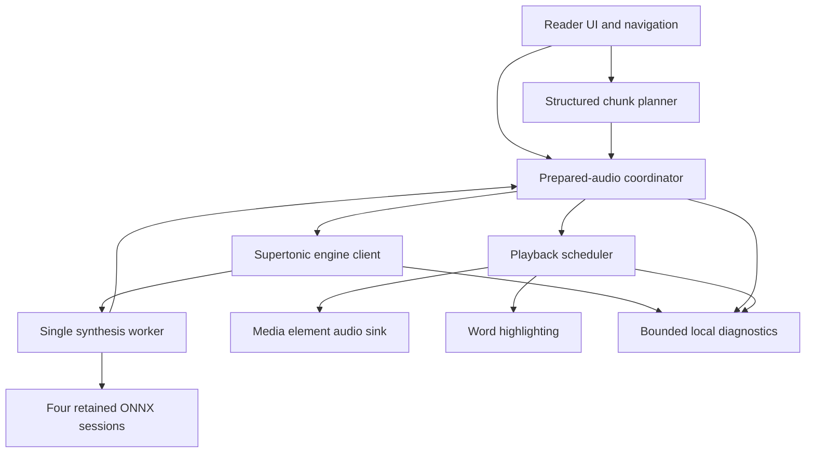
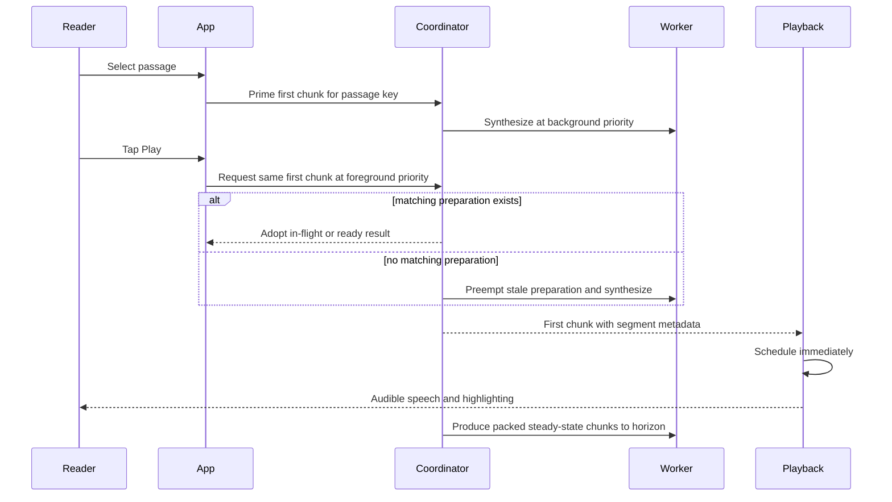
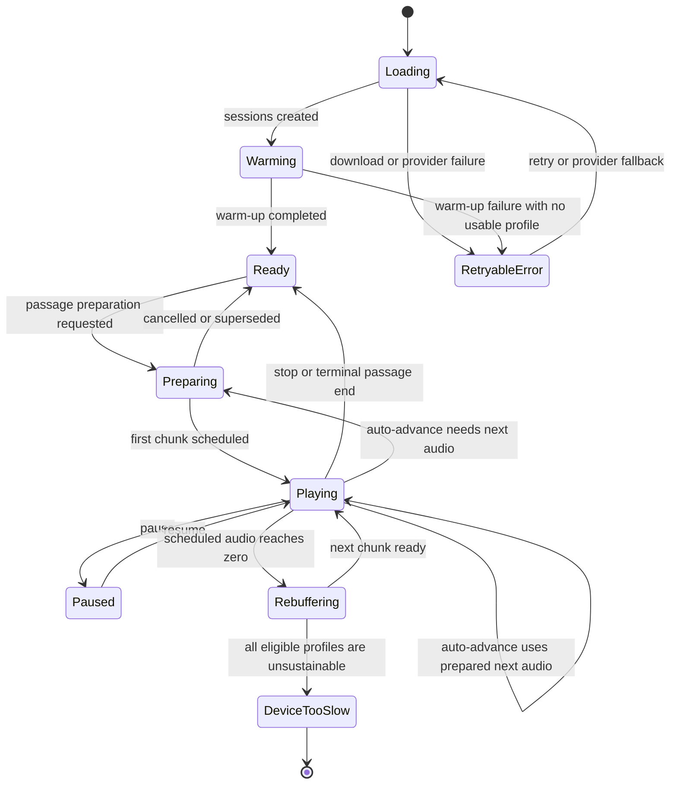

# fix: Reduce Supertonic startup latency and playback stalls

## Summary

Replace sentence-per-call synthesis and the fixed six-second startup bank with a two-stage streaming pipeline: prepare a short first chunk, then synthesize packed steady-state chunks while retaining sentence timing metadata. Make engine readiness truthful, select a sustainable runtime profile per device, prepare upcoming passage audio within a strict memory budget, and enforce latency and underrun targets in a real browser.

---

## Problem Frame

The current reader keeps the Supertonic worker and its four ONNX sessions alive across navigation, so selecting a new book or chapter does not reload the model. The observed 15–24 second delays come from repeated synthesis work before playback: every sentence runs the full inference chain, and every `start()` waits until six seconds of audio have been produced before scheduling the first chunk.

This policy only hides jitter when synthesis is sustainably faster than playback. Browser measurements found the current eight-step sentence pipeline below realtime on the tested WebGPU and WASM paths, so the reserve is slow to build and eventually drains. When it drains, the scheduler clamps a late chunk to the current audio time, producing an unmeasured audible pause.

The official Supertonic long-form implementation packs adjacent sentences up to a character budget and uses five to twelve denoising steps. Local measurements confirm that packing and five steps can improve throughput materially, but the quality and highlighting consequences must be gated rather than assumed. A first-ever model download and session compilation remain separate from the warm-engine playback target because the fp32 asset bundle is approximately 398 MB.

---

## Requirements

### Startup and navigation latency

- R1. When the Supertonic engine and selected passage are ready, tapping Play begins audible speech within 3 seconds on each supported reference-device class. Advances origin R3, R5, F1, and AE3.
- R2. A primed manual or automatic chapter transition begins audible speech within 3 seconds without reloading ONNX sessions. Advances origin R4 and F1.
- R3. First-ever model download, session creation, and warm-up report distinct progress and retryable failure states; the warm-engine 3-second target does not include the initial 398 MB transfer.

### Sustainable playback

- R4. A full long chapter completes with zero synthesis-caused audible underruns on every supported reference-device class. Advances origin R3 and R4.
- R5. Prepared and scheduled PCM, queued synthesis, and speculative passage work remain bounded; foreground playback preempts or adopts matching prefetch work.
- R6. Rapid navigation, repeated Play, voice changes, speed changes, translation changes, and cancellation never play or cache stale audio.

### Quality and compatibility

- R7. Packed synthesis preserves displayed word order and keeps highlighting within the existing perceptual synchronization target, with no accumulated chapter-long drift. Advances origin R2.
- R8. The runtime reaches a sustainable playing state, a retryable provider-failure state, or a stable device-too-slow state on WebGPU-capable, WebGPU-failing, and WASM-only browsers. Advances origin R13.
- R9. A reduced-step streaming profile may ship only after a recorded listening and timing comparison against the eight-step baseline passes.

### Verification and diagnosis

- R10. Local diagnostics distinguish model download, session creation, warm-up, first-chunk synthesis, tap-to-first-audio, provider/profile choice, buffer depth, underruns, cancellation, and prepared-audio reuse without recording Scripture text.

---

## Key Technical Decisions

- KTD1. **Use a short startup chunk followed by packed steady-state chunks:** the first chunk minimizes time to speech, while packing adjacent complete sentences amortizes the four-graph inference chain and improves sustained throughput.
- KTD2. **Preserve sentence metadata and validate estimated internal anchors:** each chunk carries constituent sentence boundaries and global word offsets. Isolated per-sentence duration predictions are scaled to the packed PCM speech span after deterministic trimming; these are estimated partitions, not observed boundaries. A packing profile qualifies only when internal-transition timing and combined synthesis-plus-timing throughput both pass. If reducing the packing ceiling to sentence-sized chunks cannot satisfy both gates, the device/profile is unsupported rather than weakening either requirement.
- KTD3. **Schedule the first completed startup chunk immediately:** remove the fixed six-second lead-in. Keep the existing 20-second scheduling horizon as the bounded steady-state lookahead.
- KTD4. **Treat underruns as measured failures:** a synthesis-caused underrun occurs when the audio clock is running, scheduled-ahead time reaches zero, and required synthesis remains incomplete. Record its count and duration separately from user pauses, tab suspension, audio-device changes, and platform interruptions.
- KTD5. **Choose and tear down one execution provider atomically:** use warm-up and real synthesis metrics instead of adding a second benchmark to first Play. Persist a profile under a fingerprint covering model/runtime versions, browser major, capability identity, isolation, WASM threads, provider, and steps. If the active profile is unsustainable, enter a visible fallback state, stop foreground work, await complete session or worker teardown, and then try one alternate provider. Never swap mid-chapter, retain duplicate session sets, or oscillate after both providers fail.
- KTD6. **Keep eight steps as the quality baseline:** five-step streaming is eligible only after listening and timing gates pass. The chosen profile stays stable for a playing chapter to avoid audible quality changes mid-reading.
- KTD7. **Prepare raw synthesis results outside the audio graph:** a bounded coordinator deduplicates foreground Play with in-flight preparation, prioritizes user-selected passages, and keys entries by every input that can change the audio. Next-passage speculation is admitted only above 12 scheduled seconds and cancelled below 8 seconds or on user interaction. Scheduled, prepared, and in-flight PCM share a 30-second or 5.3 MiB budget, whichever is reached first.
- KTD8. **Keep fp32 assets for this fix:** dynamic int8 is excluded because repository measurements found it approximately 0.08x realtime and unintelligible. FP16 remains follow-up research because it changes the asset pipeline and needs independent browser validation.

---

## High-Level Technical Design

### Component and data flow

The coordinator owns prepared raw PCM and synthesis priority; the playback controller owns only audio-clock scheduling, pause/resume, and active highlighting. This separation prevents speculative work from inheriting transport lifecycle rules such as `stop()` cancelling every request globally.

### Primed navigation and Play sequence

### Runtime and buffer lifecycle

`Ready` means warm-up has completed and foreground synthesis will not wait behind an undisclosed warm-up job. Rebuffering is observable and exceptional; supported reference devices must not enter it during the full-chapter acceptance run.

---

## Acceptance Examples

- AE1. **Warm current passage:** Given a ready engine and a primed current passage, when the reader taps Play once or repeatedly, audible speech starts within 3 seconds and preparation is not restarted.
- AE2. **Immediate unprimed Play:** Given a ready engine and an unprimed selected passage, when the reader taps Play, foreground synthesis preempts stale speculative work and reaches a bounded playing or retryable-error state.
- AE3. **Rapid navigation:** Given ten rapid book or chapter changes followed by Play, only the final passage is narrated and no stale result is retained.
- AE4. **Continuous long chapter:** Given a supported reference device, when a long chapter plays from start to finish, diagnostics report zero synthesis underruns and the highlighted word does not accumulate drift.
- AE5. **Auto-advance:** Given sufficient buffer headroom near a chapter boundary, when playback completes, the next passage uses matching prepared text and audio, including across a book boundary, without playing early.
- AE6. **Profile invalidation:** Given prepared audio, when voice, speed, translation, starting verse, step profile, backend, model version, runtime version, or source text changes, the incompatible result is not reused.
- AE7. **Provider fallback:** Given WebGPU initialization failure or device loss, when fallback is allowed, the engine disposes invalid state and reaches WASM playback or a retryable error without a reload loop.
- AE8. **First-ever load:** Given an empty browser model cache, when loading begins, the reader sees download, session creation, and warm-up progress separately; the app does not report `Ready` before warm-up finishes.

---

## Implementation Units

### U1. Add structured startup and steady-state chunk planning

- **Goal:** Produce one latency-oriented startup chunk followed by packed steady-state chunks without losing sentence or word boundaries.
- **Requirements:** R1, R4, R7, R9; origin R2, R5.
- **Dependencies:** None.
- **Files:** `src/services/tts/chunkPlanner.ts`, `src/services/tts/wordTiming.ts`, `src/services/tts/types.ts`, `tests/services/chunkPlanner.test.ts`, `tests/services/wordTiming.test.ts`
- **Approach:** Keep `splitSentences()` as the punctuation and overlong-sentence primitive. Define a pure planned-chunk contract containing packed text plus constituent sentence indices, local text spans, global word offsets, and word counts. Use a short complete first segment when possible, then pack adjacent sentences to a measured 240–300 character ceiling. Duration-predictor execution and final timing allocation belong to U3 because they depend on worker output rather than pure text planning.
- **Execution note:** Add characterization coverage for the current sentence splitter and word-offset behavior before introducing the new planner.
- **Patterns to follow:** Pure text transforms and monotonic timing assertions in `src/services/tts/wordTiming.ts` and `tests/services/wordTiming.test.ts`.
- **Test scenarios:**
  - A one-sentence passage produces one startup chunk and terminates without waiting for a steady-state chunk.
  - Several short sentences produce one short startup chunk and fewer packed steady-state chunks than the current sentence-per-call pipeline.
  - An overlong unpunctuated verse stays within the configured ceiling and loses no words.
  - Constituent sentence indices, text spans, and global word offsets are monotonic and cover the source exactly once.
  - A selected-verse start builds the first chunk and offsets from that verse rather than the chapter beginning.
  - Planned constituent spans and offsets cover the packed text exactly without overlap or gaps.
  - Abbreviations, punctuation-only fragments, empty text, and many tiny verses produce deterministic valid output.
- **Verification:** Representative KJV, WEB, and ASV passages preserve exact word order, create fewer planned steady-state chunks, and expose the constituent boundaries and offsets U3 needs for timing allocation.

### U2. Make engine readiness and runtime profiling truthful

- **Goal:** Expose accurate load phases and select a sustainable provider/step profile without doubling model memory.
- **Requirements:** R3, R8, R9, R10; origin R13.
- **Dependencies:** None.
- **Files:** `src/services/tts/synthesis.worker.ts`, `src/services/tts/supertonicEngine.ts`, `src/services/tts/runtimeProfile.ts`, `src/services/tts/diagnostics.ts`, `src/services/tts/types.ts`, `src/vite-env.d.ts`, `tests/services/runtimeProfile.test.ts`, `tests/services/supertonicEngine.test.ts`, `tests/services/diagnostics.test.ts`
- **Approach:** Move the terminal ready signal after warm-up, or model session-ready and warm-ready as separate phases while preventing foreground work from waiting behind hidden warm-up. Add the bounded, text-free diagnostics sink used by this and later units. Create all four sessions on one provider as an atomic set; if any graph fails, dispose every partial session before retrying the complete set on the fallback provider. Use a compatible persisted profile or capability-aware default, and sample warm-up and real synthesis rather than adding a second first-Play benchmark. A visible alternate-provider attempt runs only after the active profile proves unsustainable, with foreground work stopped and complete session or worker teardown awaited. Keep eight steps until the recorded five-step listening and timing gate passes.
- **Patterns to follow:** Shared `loadPromise`, worker generation cancellation, transferable audio buffers, and explicit progress fan-out in `src/services/tts/supertonicEngine.ts`.
- **Test scenarios:**
  - Concurrent callers share one load and all receive the current phase and progress.
  - `Ready` is not emitted while warm-up remains queued.
  - A compatible persisted profile is selected without profiling a second provider.
  - A stale profile is ignored after model, runtime, browser capability, or isolation changes.
  - WebGPU initialization failure falls back to WASM once and cannot loop indefinitely.
  - Partial WebGPU graph initialization disposes the partial set before all four graphs are recreated on WASM.
  - Every graph in a live session set reports the same provider identity.
  - WebGPU device loss invalidates the profile and returns the engine to a retryable state.
  - Provider selection never retains two complete ONNX session sets simultaneously.
  - A sustainable active provider does not create or benchmark the alternate provider.
  - A fallback attempt waits for teardown, runs without foreground synthesis, and stops after one failed alternate.
  - A five-step candidate remains disabled until its quality-gate record is present.
- **Verification:** Diagnostics identify download, compilation, warm-up, actual provider, steps, and measured real-time factor; the first foreground request after `Ready` is not blocked by warm-up, and provider fallback cannot create a mixed or duplicate session set.

### U3. Coordinate bounded foreground synthesis and passage preparation

- **Goal:** Deduplicate Play with prepared work, prioritize the selected passage, and prevent stale audio reuse.
- **Requirements:** R1, R2, R5, R6, R10.
- **Dependencies:** U1, U2.
- **Files:** `src/services/tts/synthesisCoordinator.ts`, `src/services/tts/synthesis.worker.ts`, `src/services/tts/supertonicEngine.ts`, `src/services/tts/types.ts`, `tests/services/synthesisCoordinator.test.ts`, `tests/services/supertonicEngine.test.ts`
- **Approach:** Make the coordinator the sole owner of engine synthesis enqueueing and cancellation; playback generations guard transport only. Resolve matching foreground adoption before cancelling speculative work, and give foreground and speculative requests separate scoped cancellation. Key prepared results by translation, book, chapter, source-text version, starting verse, voice, speed, step profile, provider, model version, and runtime version. For packed chunks, run isolated constituent duration predictions, scale their estimated spans to the final trimmed speech interval, and include that extra work in the measured production factor. Reject stale completions before caching. Retain only the current and next first chunks within the shared 30-second/5.3 MiB PCM budget.
- **Patterns to follow:** In-flight request deduplication in `src/services/bible/bibleService.ts` and generation-based cancellation in `src/services/tts/supertonicEngine.ts`.
- **Test scenarios:**
  - Play adopts an identical in-flight first-chunk preparation instead of cancelling and restarting it.
  - A foreground request preempts a different speculative passage and reaches the worker next.
  - Ten rapid passage changes leave only the final passage eligible for cache insertion.
  - Voice, speed, translation, starting verse, profile, provider, text, model, and runtime changes each produce a cache miss.
  - A stale result that completes after cancellation is discarded.
  - Transport stop cannot invalidate unrelated retained preparation.
  - Current and next prepared chunks stay within entry-count and PCM-memory bounds.
  - Estimated sentence partitions end at the packed speech boundary and internal sentence-transition samples meet the timing gate.
  - Additional duration-predictor calls are included in the chunk's end-to-end production factor.
  - A worker failure clears the invalid entry and permits a clean retry.
- **Verification:** The coordinator has deterministic priority, identity, cancellation, adoption, and eviction behavior without depending on `AudioContext`.

### U4. Replace fixed lead-in buffering with immediate, observable streaming

- **Goal:** Start after the first completed chunk and sustain gap-free playback within the existing scheduling horizon.
- **Requirements:** R1, R4, R5, R6, R7, R10; origin R2, R3.
- **Dependencies:** U1, U2, U3.
- **Files:** `src/services/audio/playbackController.ts`, `src/services/tts/types.ts`, `tests/services/playbackController.test.ts`
- **Approach:** Remove the six-second startup bank and schedule the first completed startup chunk immediately. Pull later packed chunks through the coordinator until the existing 20-second horizon is reached, replacing direct global engine cancellation with coordinator-scoped cancellation. Track scheduled-ahead seconds and record synthesis-caused underruns separately from platform interruptions. Drive sentence progress from the word clock crossing each prepared segment boundary, so every packed constituent is reported once when audible rather than when its container chunk is scheduled. Keep synthesis active while paused only until the same horizon and memory cap. Make repeated Play during `preparing` a no-op, while explicit stop or navigation cancels. On synthesis failure after playback starts, stop queued sources, clear highlighting and prepared state, then surface a retryable error.
- **Execution note:** Replace the current lead-in test with a failing first-chunk-start test and extend the slow-producer test through the complete passage before changing controller behavior.
- **Patterns to follow:** Audio-clock scheduling, pause/resume, media sink routing, and generation guards already established in `src/services/audio/playbackController.ts`.
- **Test scenarios:**
  - Playback enters `playing` when the first chunk is ready rather than after a duration threshold.
  - Repeated Play while preparing does not increment the synthesis generation or restart work.
  - A full simulated passage runs long enough to exhaust the old reserve and records zero underruns when the producer profile is sustainable.
  - A deliberately unsustainable producer records underrun count and duration, attempts at most one allowed profile fallback, and reaches the stable device-too-slow state if neither profile qualifies.
  - Pause allows bounded production to the horizon; resume does not replay, skip, duplicate, or jump highlighting.
  - Stop and superseding navigation disconnect all scheduled sources and discard stale completions.
  - Packed segment metadata produces the correct global highlighted word through chunk boundaries.
  - Each constituent sentence reports progress exactly once in audible order across pause/resume and packed-chunk boundaries.
  - A synthesis failure after some chunks were scheduled stops future audio and clears the active word.
- **Verification:** The controller starts on the first chunk, never hides late production, and preserves existing transport behavior under preparation, playback, pause, cancellation, and failure.

### U5. Prime selected and next passages through navigation flows

- **Goal:** Make manual Play and auto-advance consume matching prepared first chunks without changing navigation intent.
- **Requirements:** R1, R2, R5, R6; origin R3, R4, F1, AE3.
- **Dependencies:** U3, U4.
- **Files:** `src/App.tsx`, `src/components/AudioControls.tsx`, `src/services/bible/bibleService.ts`, `tests/app/autoAdvance.test.tsx`, `tests/app/playbackPreparation.test.tsx`
- **Approach:** Prime the selected passage after matching text and engine readiness are available, respecting save-data and connection gating. Give idle warm-up a timeout so a busy main thread cannot defer it indefinitely. Admit next-chapter preparation only above the 12-second scheduled-ahead high watermark; cancel it below 8 seconds or on Play/navigation, including cross-book transitions. Manual navigation continues to stop playback without autoplay. Immediate Play promotes or adopts incomplete preparation. Use one stable passage identity so separate book/chapter callbacks cannot leak transient work. Disable or define pause semantics while preparing, and expose accessible download, preparing, rebuffering, provider-fallback, device-too-slow, and retry states.
- **Patterns to follow:** Passage matching and `continuePlaying` handoff in `src/App.tsx`, plus book-level text caching and in-flight deduplication in `src/services/bible/bibleService.ts`.
- **Test scenarios:**
  - Engine readiness primes the current passage without autoplay.
  - Manual chapter selection stops current audio, primes only the final target, and waits for an explicit Play.
  - Immediate Play after selection adopts incomplete matching preparation.
  - Auto-advance consumes a matching prepared chunk and never starts it before the current chapter ends.
  - Auto-advance across a book boundary primes matching text and audio.
  - A next-chapter text failure preserves the existing stop-and-error behavior.
  - Voice, speed, or translation changes invalidate preparation and never play old audio.
  - Background warm-up respects save-data and slow-connection gates but runs within a bounded idle timeout when eligible.
  - Next-chapter preparation is admitted above 12 scheduled seconds and cancelled below 8 seconds without delaying foreground work.
  - Preparing, initial download, rebuffering, and retry states are exposed accessibly and do not reset on repeated Play.
- **Verification:** Manual and automatic navigation reuse only matching work, preserve current autoplay rules, and avoid model/session reloads.

### U6. Add real-browser latency, quality, and underrun release gates

- **Goal:** Make the performance fix reproducible and prevent hardware-specific assumptions from returning.
- **Requirements:** R1–R10.
- **Dependencies:** U2, U4, U5.
- **Files:** `src/services/tts/diagnostics.ts`, `tests/e2e/supertonicLatency.spec.ts`, `playwright.config.ts`, `README.md`, `walkthrough.md`
- **Approach:** Store a bounded in-memory diagnostics snapshot with phase timings, provider/profile, chunk sizes, real-time factors, prepared-audio hits, buffer low-water mark, underruns, and cancellation latency; never store passage text. Add real-browser projects or fixtures for WebGPU-capable and WASM fallback paths on defined reference hardware. Separate cold empty-cache load measurements from engine-ready playback gates. Record the five-step versus eight-step listening and highlighting comparison as a release artifact before enabling the reduced-step profile. Update documentation that currently treats one machine's WASM throughput and fixed lead-in as universal.
- **Patterns to follow:** Existing Playwright configuration, real-browser performance comments in `playwright.config.ts`, and cross-origin isolation deployment checks in `README.md` and `vite.config.ts`.
- **Test scenarios:**
  - Engine-ready current-passage Play reaches audible speech within 3 seconds.
  - A primed manual and automatic chapter transition reaches audio within 3 seconds.
  - An immediate unprimed Play reaches the separately documented bounded fallback state.
  - Psalm 119 or another agreed long chapter completes with zero synthesis underruns on every supported reference-device class.
  - WebGPU success, WebGPU initialization failure, simulated device loss, and WASM-only execution each reach playing or a retryable terminal state.
  - Ten rapid passage changes followed by Play narrate only the final selection.
  - Pause/resume before and after the buffer horizon produces no replay, skip, duplicate synthesis, or highlight jump.
  - Full-chapter highlighting preserves word order, stays within the accepted timing tolerance, and shows no accumulated drift.
  - Cold model download reports phases separately and is never included in the warm-engine latency assertion.
  - Diagnostics contain no Scripture text and remain within their retention bound.
- **Verification:** The browser suite produces provider-specific latency and underrun evidence, and a documented quality comparison authorizes or rejects the reduced-step streaming profile.

---

## System-Wide Impact

- **Reader experience:** Play, manual navigation, auto-advance, pause/resume, progress states, and error recovery change together; manual navigation still does not autoplay.
- **TTS lifecycle:** The four sessions remain process-resident, but readiness now includes warm-up and provider state is versioned and observable.
- **Memory and CPU:** The 20-second playback horizon remains. Speculative synthesis is limited to first chunks for the current and next passage, and paused playback cannot synthesize without bound.
- **Highlighting:** Global word indices remain the UI contract. Packed chunks introduce segment metadata beneath that contract rather than changing displayed Bible data.
- **Deployment:** Cross-origin isolation remains a hard performance dependency for multithreaded WASM and must be asserted in deployed browser diagnostics.

---

## Risks & Dependencies

- **Five-step quality may be unacceptable:** local throughput improves substantially at five steps, but prior repository notes report artifacts below eight. Mitigation: eight remains baseline and the reduced profile is gated by recorded listening and timing comparisons.
- **Packed timing may exceed the synchronization tolerance:** the model exposes an utterance duration rather than observed word timestamps. Mitigation: retain sentence metadata, use per-sentence predictor estimates normalized to the packed speech span, and reduce packing if the full-chapter gate fails.
- **Some devices may remain slower than realtime:** no startup buffer can permanently hide an unsustainable producer, and the measured 1.01x WASM result has no jitter margin. Mitigation: require the lower decile of representative steady-state chunks to produce at least 1.25 audio seconds per synthesis second, then surface a stable device-too-slow state if all eligible profiles fail.
- **Transient jitter can drain an otherwise sustainable producer:** average throughput alone does not prove continuity. Mitigation: qualify with controlled CPU contention, require scheduled-ahead time to remain above zero, and distinguish synthesis-caused underruns from platform interruptions.
- **Provider fallback can inflate cold start or memory:** sequential disposal does not guarantee immediate allocation reclamation. Mitigation: fallback is visible and idle-only, cancelled by Play/navigation, attempted once per compatibility fingerprint, and uses worker recreation when teardown cannot prove release before alternate allocation.
- **Speculative work can block the user:** the worker is serial. Mitigation: foreground priority, matching-promise adoption, 12-second admission and 8-second eviction watermarks, a shared 30-second/5.3 MiB PCM cap, bounded cancellation checks, and stale-result rejection.
- **Production headers can silently regress WASM throughput:** without cross-origin isolation, ONNX Runtime can fall back to single-threaded execution. Mitigation: record isolation and thread availability in browser gates and deployment diagnostics.

---

## Scope Boundaries

### In scope

- Warm-engine startup, manual transition, and auto-advance latency.
- Supertonic chunking, provider/step profiling, readiness, prioritization, prefetch, scheduling, and local diagnostics.
- Word-timing preservation required by packed synthesis.
- Deterministic unit/integration tests and real-browser performance gates.

### Deferred to Follow-Up Work

- FP16 model conversion, browser compatibility, asset-size comparison, and hosting changes.
- Persistent generated-audio downloads for offline playback.
- A server-side or alternative TTS fallback for devices that cannot sustain any supported on-device profile.
- Broad UI redesign beyond the statuses and controls required to make preparation, rebuffering, and retry behavior clear.

### Carried from origin as deferred

- Reading plans, devotionals, bookmarks, highlights, notes, search, multiple cloned voices, social features, and additional paid translations.

### Outside this product's identity

- Bible study tools, AI-generated summaries or explanations, community features, and video content.

---

## Operational and Rollout Notes

### Qualification protocol

- Before enabling a profile, record the physical device and OS, browser major, provider, logical cores, power mode, cross-origin isolation, WASM threads, and model/runtime versions. The execution-time matrix must include every browser/provider class claimed as supported by origin R13.
- Define production speed consistently as generated audio seconds divided by synthesis wall seconds. Require a lower-decile steady-state speed of at least 1.25x over representative packed chunks.
- Run at least ten warm-engine TTFA repetitions per class and require the 95th percentile at or below 3 seconds. Run at least three complete long-chapter repetitions plus one controlled-jitter run with zero synthesis-caused underruns.
- Report p50/p95/p99 chunk synthesis time, production speed, minimum scheduled-ahead seconds, underrun count/duration, cancellation latency, prepared-audio adoption, speculative CPU time, peak prepared bytes, peak worker/process memory, and UI long tasks.
- Keep first-ever empty-cache download/session metrics separate from engine-ready playback metrics. Record platform audio interruptions separately from synthesis-caused underruns.

### Staged rollout

1. Ship diagnostics and outcome classification without changing playback policy.
2. Enable structured packed chunks and immediate first-chunk scheduling at eight steps, with prefetch disabled.
3. Enable persisted provider profiling and one-attempt visible fallback.
4. Enable bounded selected/next-passage preparation only if foreground latency and buffer low-water marks do not regress.
5. Enable five-step synthesis only on device classes that pass the independent listening, highlighting, throughput, and memory gates.

Keep independent rollback controls for provider fallback, speculative preparation, and reduced steps. Each stage reruns TTFA, sustained throughput, controlled jitter, peak memory/CPU, highlighting, cancellation, and stale-audio gates against the preceding stage. Any synthesis-caused underrun, stale passage playback, session reload during navigation, failed highlighting comparison, crash, device loss, or foreground-latency regression is a no-go for that stage.

---

## Sources & Research

- Origin requirements: `docs/brainstorms/2026-08-13-bible-voice-reader-requirements.md`
- Prior architecture plan: `docs/plans/2026-08-14-001-feat-scripture-voice-v1-plan.md`
- Current implementation: `src/services/tts/synthesis.worker.ts`, `src/services/tts/supertonicEngine.ts`, `src/services/tts/wordTiming.ts`, `src/services/audio/playbackController.ts`, and `src/App.tsx`
- Official Supertonic long-form chunking and inference chain: [Supertone Supertonic web helper](https://github.com/supertone-inc/supertonic/blob/main/web/helper.js) and [web demo](https://github.com/supertone-inc/supertonic/blob/main/web/main.js)
- Official browser setup and supported runtime behavior: [Supertonic web README](https://github.com/supertone-inc/supertonic/blob/main/web/README.md)
- Local browser diagnosis on 2026-08-15: warm-engine Genesis 1 startup measured 15.44 seconds; Genesis 2 after navigation measured 24.23 seconds. Packed five-step synthesis measured 1.62x realtime on WebGPU and 1.01x on WASM, while the current sentence/eight-step pipeline measured below realtime on both providers.
- Model-build constraint: `scripts/build-model-assets.mjs` records dynamic int8 at approximately 0.08x realtime with unintelligible output, so it is not a viable latency fix.
