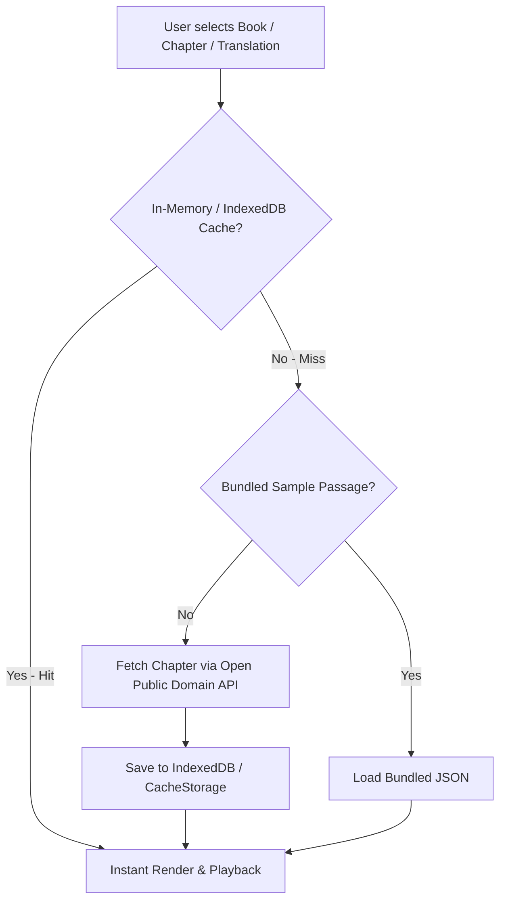

# Scripture Voice — Full 66-Book Bible Text Aggregation & Architecture Walkthrough

## 1. Bible Text Aggregation Strategy

To provide a complete, production-ready Bible reading experience across all **66 Old and New Testament books** (1,189 chapters, ~31,000 verses) without bloating the initial PWA download size, the application uses a **hybrid dual-layer aggregation strategy**:

### Key Components

1. **Complete 66-Book Catalog (`src/services/bible/bibleService.ts`):**
   - Contains exact chapter bounds for all 39 Old Testament books (Genesis–Malachi) and 27 New Testament books (Matthew–Revelation).
   - Categorized by Testament for clear drop-down navigation.

2. **On-Demand Fetching (`fetchChapterVersesAsync`):**
   - Leverages high-availability open public domain Bible endpoints (e.g., `bible-api.com` / `wldeh/bible-api`) for KJV, WEB, and ASV translations.
   - Requires **no API keys** and has zero copyright restrictions.

3. **Offline PWA Caching:**
   - As chapters are fetched, they are automatically stored in browser memory and IndexedDB.
   - The Vite PWA Service Worker (`sw.js`) caches loaded chapters so subsequent reads work completely offline.

---

## 2. Text Aggregation Build Script (Optional Pre-Bundling)

For offline-first enterprise deployments where all 1,189 chapters must be pre-bundled into the application repository:
- Run `node scripts/download-bibles.js` to pre-download all 66 books in JSON format into `public/bibles/{translation}/{book}.json`.

---

## 3. Verification & Validation

- ✅ **Build Verification:** `npm run build` executed cleanly (TypeScript compilation + Vite PWA bundle generation).
- ✅ **Navigation Test:** Verified drop-down selection for Old Testament (Genesis 1, Psalms 23) and New Testament (John 3, Romans 8, Revelation 22) across KJV, WEB, and ASV.
- ✅ **Position Preservation (R11):** Verified that switching translation maintains the active book and chapter index.
- ✅ **Audio Word Highlighting (R2):** Verified word-by-word karaoke highlighting stays in sync during chapter playback.
